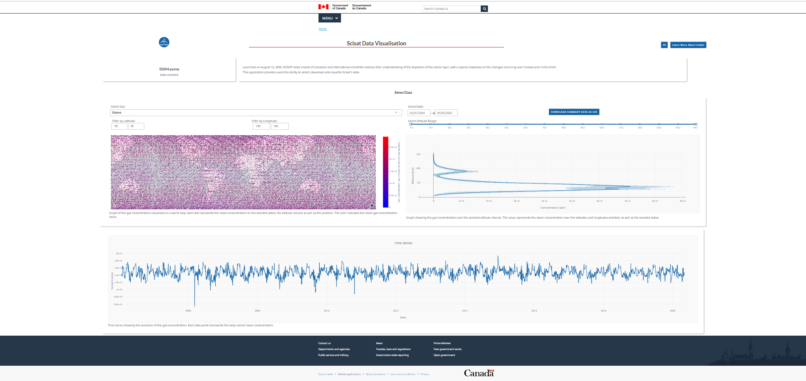

- [Français](#application-pour-filtrer-et-visualiser-les-données-de-scisat)
- [English](#application-to-filter-and-visualize-scisat-data)

# Application pour filtrer et visualiser les données de SCISAT

## Contexte

Le satellite SCISAT, en orbit depuis le 12 août 2003, aide des équipes de scientifiques canadiens et internationaux à améliorer leur compréhension de la déplétion de la couche d'ozone, en se concentrant particulièrement sur les changements au Canada et en Arctique. 

## Démarrage rapide
Les commandes suivantes peuvent être exécutées plus facilement dans un environnement virtuel (comme conda). Il peut donc être judicieux d'installer [Anaconda](https://www.anaconda.com/distribution/) au préalable.

Pour démarrer l'application :

- Dans l'[application dash multiple](https://github.com/Camille-Jonathan-asc-csa/Scisat-App)

        pip install -r requirements.txt
        python run.py

- Ajouter */scisat* dans l'url

## Construit avec:

 - [Plotly Dash](https://dash.plot.ly/) - Le framework Python construit sur Flask a été utilisé pour développer l'application. Tous les composants et visualisations de l'application web sont des objets Dash qui sont créés et mis à jour dans les fonctions de rappel de l'application. Je vous recommande de consulter la documentation complète de Dash (lien) si vous n'êtes pas sûr de son fonctionnement.

## Navigation et fichiers

 - [scisat.py](scisat.py) est l'application principale où chaque composant et la présentation de l'application sont définis 
 
 - [controls.py](controls.py) contient les options pour certains des composants (par exemple, les dropdowns)

 - [header_footer.py](header_footer.py) contient le html pour l'en-tête et le pied de page du gouvernement du Canada. Ce html est injecté dans l'application principale.
 
 - [/assets](assets) contient différents fichiers pour le style de l'application (images, redimensionnement, css)
 
 - [/data](data) contient les données csv traitées provenant du pipeline d'extraction des caractéristiques

 - [/data_cleaning](data_cleaning) contient des scripts pythons utilisés pour nettoyer les données extraites

 - [messages.pot](message.pot) et [/translations](translations) contient des informations sur la traduction

 - [config.py](config.py) précise les langues disponibles pour la traduction

# Application to filter and visualize SCISAT data

## Background

Launched on August 12, 2003, SCISAT helps a team of Canadian and international scientists improve their understanding of the depletion of the ozone layer, 
 with a special emphasis on the changes occurring over Canada and in the Arctic.

This project is an application that allows users to filter through the SCISAT data on
 multiple parameters and allows users to visualize a summary of the data from their selected parameters on a
 world map, a graph on the altitude, a time series, forgoing the need for downloading the data for simple insights. 

This project has been developped from the Alouette app, a case study for the development of future satellite data applications so that the data from
 from these satellites are able to be obtained and analyzed at a larger scale and in a more user-friendly way.

## Quick start

The following commands can be done more easily if in a virtual environment (like conda) so it may be a good idea to install [Anaconda](https://www.anaconda.com/distribution/) beforehand. 

For starting the application:

- Go to the [mutliple dash application](https://github.com/Camille-Jonathan-asc-csa/Scisat-App)

        pip install -r requirements.txt
        python run.py

- Add */scisat* in the url

Separate installation instructions for the production version of the app are provided in "SCISAT Production Installation Guide.docx".

## Built with

 - [Plotly Dash](https://dash.plot.ly/) - The Python framework built on top of Flask used to develop the application. All components and visualizations on the web application are Dash objects that are created and updated in the callback functions in app.py. I would recommend that you look over Dash's comprehensive documentation (linked) if you are unsure how it works.

## Navigation and files

 - [scisat.py](scisat.py) is the main application where each component and the layout of the application is defined 
 
 - [controls.py](controls.py) contains the options for the some of the components (e.g. dropdowns)

 - [header_footer.py](header_footer.py) contains the html for the government of Canada header and footer. This html is injected into the main app.
 
 - [/assets](assets) contains various files for the styling of the application (images, resizing, css)
 
 - [/data](data) contains the raw data in NetCDF format

 - [/data_cleaning](data_cleaning) contains python scripts used to clean the extracted data

 - [messages.pot](message.pot) and [/translations](translations) contains translation information

 - [config.py](config.py) specifies the languages available for translation

## Accessibility and branding
 - Due to [Canada.ca branding requirements](https://wet-boew.github.io/themes-dist/GCWeb/index-en.html), much of the CSS of the application will need to be changed and the Government of Canada header and footer will need to be added
    - There will be stricter Government of Canada requirements when the CSA website gets merged with Canada.ca in March of 2020
    - More note on Government of Canada branding can be found here: [http://livelink/livelink/llisapi.dll?func=ll&objId=43843079&objAction=viewheader](http://livelink/livelink/llisapi.dll?func=ll&objId=43843079&objAction=viewheader)
 - Due to the [Government of Canada Standard on Web Accessibility](https://www.tbs-sct.gc.ca/pol/doc-eng.aspx?id=23601), there will likely need to be changes to the frontend or CSS
    - The [Web Experience Toolkit](https://wet-boew.github.io/v4.0-ci/index-en.html) can be used to help reach this standard, but it is not necessary
    - More notes on accessibility can be found here: [http://livelink/livelink/llisapi.dll?func=ll&objId=43801583&objAction=viewheader]([http://livelink/livelink/llisapi.dll?func=ll&objId=43801583&objAction=viewheader])
 
There will need to be changes in app.py to change colours and styles of the interactive visualizations as well as the HTML layout of the page.

## Header/Footer

- The government header/footer code is saved in a separate file (header_footer.py), and is directly injected into the dash app.

## Translations

 - Translations are tricky with Dash due to the way it renders the page. To learn how to make new translations, consult [https://blog.miguelgrinberg.com/post/the-flask-mega-tutorial-part-xiii-i18n-and-l10n]([https://blog.miguelgrinberg.com/post/the-flask-mega-tutorial-part-xiii-i18n-and-l10n])

 - Each text element to be translated in dash has to be given a component ID (see Dash documentation for more details on this). The component is subsequently re-rendered on language switch. 

## Downloads

- Download button is not effective at the moment. It will need to be modified in order to work properly

## Authors
 - Camille Roy
 - Jonathan Beaulieu-Emond
 
## Acknowledgments
 - Etienne Low-Decarie
 - Hansen Liu & Wasiq Mohammad 
